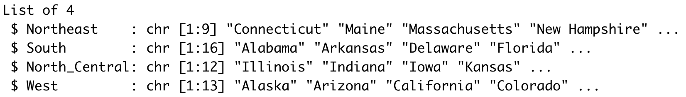

```{r load_packages, include=FALSE}
library(tidyverse)
library(dslabs)
```

**You are required to process the data `us_contagious_diseases` (available from package `dslabs`) via the 5 sequential steps given in the questions below.**

### Question 1 (1 pt): `state.name` and `state.region` are R built-in vectors that give the full names of the 50 US states and their corresponding geographic regions (Northeast, South, North Central, West), respectively. Note that all data are arranged according to alphabetical order of the state names. Create a list of 4 atomic vectors, named as `region_state`, where each atomic vector represents one geographic region, is labeled with the region name, and contains the names of all the region's states. Output the structure of the list `region_state`. Your output should look like as follows:
 

**Answer:** 
```{r}
library(dslabs)
regions <- unique(state.region)[c(3, 1, 4, 2)]
region_state <- list()
for (r in regions) {
  # region_state[r] <- 0
  region_state[[r]] <- state.name[state.region == r]
}
str(region_state)
```
### Question 2 (1 pt): Add `"District Of Columbia"` into the element `South` of the list `region_state` you created in Question 1. Output the structure of the new `region_state` list. 
**Answer:** 
```{r}
region_state[['South']] <- sort(c('District of Columbia', region_state[['South']]))
str(region_state)
```
### Question 3 (1 pt): From the data `us_contagious_diseases` of package `dslabs`, ignoring the variable `weeks_reporting`, compute the yearly incidence rate of each disease for each of the 4 geographic regions (Northeast, South, North Central, West). Store the result into a new data frame, named as `region_incidence`, with columns `disease`, `region`, `year`, and `incidence_per_millon` (i.e., the yearly incidence rate times one million). Provide the output of `head(region_incidence)` and `dim(region_incidence)`. Note that you need to drop the missing values (`NA`) of `us_contagious_diseases` after deleting the variable `weeks_reporting`. 
**Answer:** 
```{r}
library(tidyverse)
region_incidence <- us_contagious_diseases %>%
  select(!'weeks_reporting') %>%
  drop_na() %>%
  mutate(region = case_when(state %in% region_state[[1]] ~ regions[1],
                            state %in% region_state[[2]] ~ regions[2],
                            state %in% region_state[[3]] ~ regions[3],
                            .default = regions[4])) %>%
  group_by(disease, region, year) %>%
  summarise(incidence_per_million = round(sum(count) / sum(population) * 10**6, 1))

head(region_incidence)
dim(region_incidence)
```
### Question 4 (1 pt): In the data frame `region_incidence`, choose an appropriate `str_` function to add the suffix `_US` to the values in the column `region`. Make sure that the resulting column `region` is a factor with levels in the order: `North_Central_US`, `Northeast_US`, `South_US`, `West_US`. Provide the output of `head(region_incidence)` and `levels(region_incidence$region)`.
**Answer:** 
```{r}
region_incidence <- region_incidence %>% 
  mutate(region = factor(str_c(gsub(' ', '_', region), '_US'))) %>%
  mutate(region = fct_relevel(region, sort))
head(region_incidence)
levels(region_incidence$region)
```
### Question 5 (1 pt): From `region_incidence`, use `ggplot` to provide a line graph that shows the trend of the yearly incidence of disease `Hepatitis A` for all the 4 geographic regions. You need to appropriately reorder the factor levels of `region` to make the graph easier to read with the legend. What is your reordering of the `region`'s factor levels and why does it enhance the readability of your graph?
**Answer:** 
```{r}
region_incidence %>%
  filter(disease == 'Hepatitis A') %>%
  group_by(region) %>%
  mutate(mean_incidence = mean(incidence_per_million)) %>%
  ungroup() %>%
  # mutate(region = fct_relevel())
  # mutate(region = fct_relevel(region, ))
  ggplot() +
  geom_line(aes(x = year, y = incidence_per_million, color = fct_reorder2(region, year, incidence_per_million, .fun = first2))) +
  labs(color = 'region')
```
My reordering orders the legend based on the starting points of each line on the left: `West_US` has the highest left endpoint so it is the topmost region in the legend and `Northeast_US` has the lowest left endpoint so it is at the bottom of the legend. This improves readability because it matches the visual order of the regions in both the plot and legend.