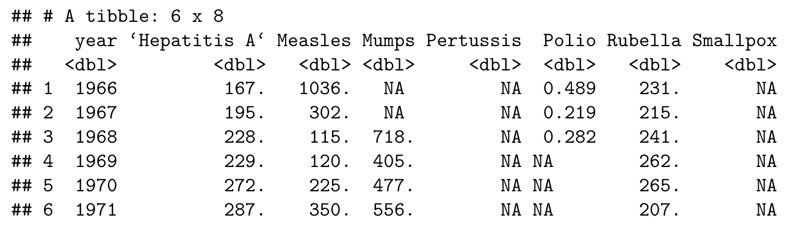

```{r load_packages, include=FALSE}
library(tidyverse)
library(dslabs)
```

**You are required to process the data `us_contagious_diseases` (available from package `dslabs`) via the 5 sequential steps given in the questions below.**

### Question 1 (1 pt): From the data `us_contagious_diseases`, ignoring the variable `weeks_reporting`, compute the yearly incidence rate of each disease for the entire country. Store the result into a new data frame, named as `US_incidence`, with columns `disease`, `year`, and `incidence_per_millon` (i.e., the yearly incidence rate times one million). Provide the output of `head(US_incidence)` and `dim(US_incidence)`. Note that you need to drop the missing values (`NA`) of `us_contagious_diseases` after deleting the variable `weeks_reporting`. 
**Answer:** 
```{r}
US_incidence <- us_contagious_diseases %>%
  select(-weeks_reporting) %>%
  drop_na() %>%
  group_by(disease, year) %>%
  summarise(incidence_per_million = signif((sum(count) / sum(population)) * 10**6, 3))

head(US_incidence)
dim(US_incidence)
```
### Question 2 (1 pt): Pivot the data frame `US_incidence` into a new one that shows the `incidence_per_millon` values for all diseases of the same year at the same row. Still use  the name `US_incidence` for the new data frame. Then provide the output of `head(US_incidence)` and `dim(US_incidence)`. Note that the output of `head(US_incidence)` should look like as follows:
 
**Answer:** 
```{r}
US_incidence <- US_incidence %>% pivot_wider(names_from = disease, values_from = incidence_per_million)

head(US_incidence)
dim(US_incidence)
```
### Question 3 (1 pt): Carefully read the documentation of the function `cor()` of package `stats`. According to the new data frame `US_incidence` from Question 2, compute the Pearson's correlation between `Hepatitis A` and `Measles` in terms of `incidence_per_millon`. Due to missing values, you need to choose an appropriate value for the `use` argument in `cor()`.
**Answer:** 
```{r}
cor(US_incidence$`Hepatitis A`, US_incidence$Measles, use = 'complete.obs')
```
### Question 4 (1 pt): According to the new data frame `US_incidence` from Question 2, use one of the `map` functions to compute the Pearson's correlation between `Hepatitis A` and each of the other 6 diseases in terms of `incidence_per_millon`, and return a `double` vector as the output.
**Answer:** 
```{r}
map_dbl(select(US_incidence, -c(1, 2)), cor, y = US_incidence$`Hepatitis A`, use = 'na.or.complete')
```
### Question 5 (1 pt): According to the new data frame `US_incidence` from Question 2, for each of the 7 diseases, find its most positively (Pearson's) correlated disease (except itself) and corresponding correlation. Simplify your code by loops or the `map` functions. 
**Answer:** 
```{r}
max_cors <- tibble(disease = character(),
                  most_cor_disease = character(),
                  cor_coef = numeric())
for (disease in colnames(US_incidence[-1])) {
  cors <- map_dbl(select(US_incidence, -year, -disease), cor, y = US_incidence[disease], use = 'na.or.complete')
  mcor <- cors[which.max(cors)]
  max_cors <- max_cors %>% 
    add_row(disease = disease,
            most_cor_disease = names(mcor),
            cor_coef = mcor)
}
max_cors
```
